# 🏨 Roomora – Hotel Booking System (Microservices Architecture)

 

---

## ✨ Overview
**Roomora** is a cloud-ready hotel booking platform built with **Spring Boot Microservices architecture**.
It allows guests, property owners, and admins to interact in a seamless way — from property listing to booking, payments, and notifications. All managed through independent services with centralized service discovery and API gateway.

---

## 👥 Roles & Features
### 🏨 Guests (Customers)

- 🔍 Search and filter hotels/properties by city, date, availability.

- 📅 Book rooms and manage reservations.

- 💳 Make secure payments via Stripe.

- 📩 Receive email/SMS notifications (booking confirmation, updates, etc.).

### 🏠 Property Owners

- 🏗️ Register and list properties with rooms, images, and details.

- 📊 Manage availability and pricing of rooms.

- ✅ Get notified when a booking is made.

- 💵 Receive payments after guest check-in/checkout.

### 🛡️ Admin

- 👨‍💻 Manage and monitor all users, properties, and bookings.

- 📜 View system logs and monitor services through the Admin Server.

- 🔐 Ensure system security and compliance.

- 🧩 Handle exceptions (e.g., fraudulent activities, disputes).

---

## 🏗️ Microservices Overview

| Service | Description |
| :--- | :--- |
| 🖥️ Admin Server | Spring Boot Admin – monitor microservices |
| 🌐 API Gateway | Routes requests to microservices (Spring Cloud Gateway) |
| 🔑 Auth Service | Handles login, signup, JWT authentication |
| 🏡 Property Service | Manage hotels, rooms, availability |
| 📅 Booking Service | Booking creation, availability management |
| 💳 Payment Service | Stripe sandbox integration for payments |
| 📢 Notification Service | Sends email/SMS notifications using Kafka |
| 📡 Service Registry (Eureka) | Service discovery for microservices |

---

## 🏗️ System Architecture

```mermaid
flowchart TD
    Client([🧑 User]) -->|Login / Booking| Gateway[🌐 API Gateway]
    Gateway --> Auth[🔑 Auth Service]
    Gateway --> Property[🏡 Property Service]
    Gateway --> Booking[📅 Booking Service]
    Gateway --> Payment[💳 Payment Service]
    Gateway --> Notification[📢 Notification Service]
    
    Auth --> Eureka[📡 Service Registry<br/>Eureka]
    Property --> Eureka
    Booking --> Eureka
    Payment --> Eureka
    Notification --> Eureka
    
    Admin[🖥️ Admin Server] --> Eureka
    
    %% Styling for better visual hierarchy and contrast
    classDef default fill:#ffffff,stroke:#2c3e50,stroke-width:2px,color:#2c3e50;
    classDef service fill:#3498db,stroke:#2980b9,stroke-width:2px,color:#ffffff;
    classDef registry fill:#e74c3c,stroke:#c0392b,stroke-width:2px,color:#ffffff;
    classDef client fill:#2ecc71,stroke:#27ae60,stroke-width:2px,color:#ffffff;
    classDef gateway fill:#9b59b6,stroke:#8e44ad,stroke-width:2px,color:#ffffff;
    
    class Auth,Property,Booking,Payment,Notification,Admin service;
    class Eureka registry;
    class Client client;
    class Gateway gateway;
```

---

## 🛠️ Tech Stack

**Backend**  

**Microservices**  

**Database**  

**Payment**  

**Security**  

**Tools**  

**Others**  

---

## 🔑 Setup & Installation Guide

Step-by-step:

1. Clone repo.

2. Configure `.env` or `application.yml` for DB & Stripe keys.

3. Run `mvn clean install`.

4. Start services in order (`Eureka → Config → Gateway → Others`).

5. Access API docs (e.g., `http://localhost:8080/swagger-ui`).

---

## 📊 Database Schemas

### 🔐 Microservice: `Auth Service`
**`📝 User Table Schema`**

| Column Name | Data Type | Constraints                 | Description                                        |
| ----------- | --------- | --------------------------- | -------------------------------------------------- |
| id          | BIGINT    | Primary Key, Auto Increment | Unique identifier for each user                    |
| name        | VARCHAR   | NOT NULL                    | Full name of the user                              |
| username    | VARCHAR   | NOT NULL, UNIQUE            | Username used for login                            |
| email       | VARCHAR   | NOT NULL, UNIQUE            | Email address of the user                          |
| password    | VARCHAR   | NULLABLE                    | Encrypted password                                 |
| role        | VARCHAR   | NULLABLE                    | Role of the user (ADMIN / PROPERTY\_OWNER / GUEST) |

###########################################################################################################

### 🏡 Microservice: `Property Service`
1. **`📝 Property Table Schema`**

| Column Name                | Data Type | Description                     |
| -------------------------- | --------- | ------------------------------- |
| `id` (PK)                  | BIGINT    | Unique property ID              |
| `name`                     | VARCHAR   | Name of the property            |
| `number_of_beds`           | INT       | Total beds in the property      |
| `number_of_rooms`          | INT       | Total rooms                     |
| `number_of_bathrooms`      | INT       | Number of bathrooms             |
| `number_of_guests_allowed` | INT       | Max guests allowed              |
| `property_owner_language`  | VARCHAR   | Preferred language of the owner |
| `city_id` (FK)             | BIGINT    | Linked city                     |
| `area_id` (FK)             | BIGINT    | Linked area                     |
| `state_id` (FK)            | BIGINT    | Linked state                    |
| `country_id` (FK)          | BIGINT    | Linked country                  |

2. **`🛏️ Rooms Table Schema`**

| Column Name        | Data Type | Description                                |
| ------------------ | --------- | ------------------------------------------ |
| `id` (PK)          | BIGINT    | Room ID                                    |
| `room_type`        | VARCHAR   | Type of room (Single, Double, Suite, etc.) |
| `base_price`       | DECIMAL   | Base price for booking                     |
| `property_id` (FK) | BIGINT    | Linked property                            |

3. **`📅 Room Availability Table Schema`**

| Column Name       | Data Type | Description                                   |
| ----------------- | --------- | --------------------------------------------- |
| `id` (PK)         | BIGINT    | Availability ID                               |
| `available_date`  | DATE      | Date of availability                          |
| `available_count` | INT       | Number of rooms available on that date        |
| `price`           | DECIMAL   | Price for that date (can override base price) |
| `room_id` (FK)    | BIGINT    | Linked room                                   |

4. **`🖼️ Property Photos Table Schema`**

| Column Name        | Data Type | Description                                                  |
| ------------------ | --------- | ------------------------------------------------------------ |
| `id` (PK)          | BIGINT    | Photo ID                                                     |
| `url`              | VARCHAR   | Image URL (stored in cloud storage like AWS S3 / Cloudinary) |
| `property_id` (FK) | BIGINT    | Linked property                                              |

5. **`🌍 Location Tables`**

- Country

| Column Name | Data Type | Description  |
| ----------- | --------- | ------------ |
| `id` (PK)   | BIGINT    | Country ID   |
| `name`      | VARCHAR   | Country name |

- State

| Column Name       | Data Type | Description    |
| ----------------- | --------- | -------------- |
| `id` (PK)         | BIGINT    | State ID       |
| `name`            | VARCHAR   | State name     |
| `country_id` (FK) | BIGINT    | Linked country |

- City

| Column Name     | Data Type | Description  |
| --------------- | --------- | ------------ |
| `id` (PK)       | BIGINT    | City ID      |
| `name`          | VARCHAR   | City name    |
| `state_id` (FK) | BIGINT    | Linked state |

- Area

| Column Name    | Data Type | Description |
| -------------- | --------- | ----------- |
| `id` (PK)      | BIGINT    | Area ID     |
| `name`         | VARCHAR   | Area name   |
| `city_id` (FK) | BIGINT    | Linked city |

**📌 Entity Relationship Diagram (ERD)**

###########################################################################################################

### 📦 Microservice: `Booking Service`
1. **`📝 Bookings Table Schema`**

| Column Name             | Data Type    | Constraints               | Description                                   |
| ----------------------- | ------------ | ------------------------- | --------------------------------------------- |
| `id`                    | BIGINT (PK)  | AUTO\_INCREMENT, NOT NULL | Unique booking identifier                     |
| `name`                  | VARCHAR(100) | NOT NULL                  | Guest name                                    |
| `email`                 | VARCHAR(100) | NOT NULL                  | Guest email address                           |
| `mobile`                | VARCHAR(20)  | NOT NULL                  | Guest contact number                          |
| `property_id`           | BIGINT       | NOT NULL                  | Reference to property (from Property Service) |
| `room_id`               | BIGINT       | NOT NULL                  | Reference to specific room                    |
| `property_name`         | VARCHAR      |                           | Name of the booked property                   |
| `room_type`             | VARCHAR      |                           | Type of room (e.g., Deluxe, Standard)         |
| `check_in_date`         | DATE         | NOT NULL                  | Check-in date                                 |
| `check_out_date`        | DATE         | NOT NULL                  | Check-out date                                |
| `total_price`           | DECIMAL      | NOT NULL                  | Total price for the booking                   |
| `payment_status`        | VARCHAR(20)  |                           | Payment status (PENDING, PAID, FAILED)        |
| `transaction_id`        | VARCHAR      |                           | Transaction identifier from payment gateway   |
| `payment_intent_id`     | VARCHAR      |                           | Stripe payment intent ID                      |
| `refund_transaction_id` | VARCHAR      |                           | Refund transaction ID (if cancelled)          |
| `status`                | VARCHAR(20)  |                           | Booking status (CONFIRMED, CANCELLED, etc.)   |
| `total_nights`          | INT          |                           | Total nights of stay                          |
| `created_at`            | TIMESTAMP    | AUTO GENERATED            | Timestamp when booking was created            |
| `updated_at`            | TIMESTAMP    | AUTO GENERATED            | Last updated timestamp                        |

2. **`📅 BookingDate Table Schema`**

| Column Name  | Data Type   | Constraints                        | Description                    |
| ------------ | ----------- | ---------------------------------- | ------------------------------ |
| `id`         | BIGINT (PK) | AUTO\_INCREMENT, NOT NULL          | Unique booking-date identifier |
| `date`       | DATE        | NOT NULL                           | Specific date of the booking   |
| `booking_id` | BIGINT (FK) | NOT NULL, REFERENCES `Bookings.id` | Links to a booking record      |

**📌 Entity Relationship Diagram (ERD)**

---

## 5️⃣ Access Application

- API Gateway → `http://localhost:5555/`
- Eureka Server → `http://localhost:8761/`
- Admin Server → `http://localhost:8080/`
- Auth Service → `http://localhost:8081/`
- Property Service → `http://localhost:8082/`
- Booking Service → `http://localhost:8084/`
- Payment Service → `http://localhost:8085/`
- Notification Service → `http://localhost:8083/`

